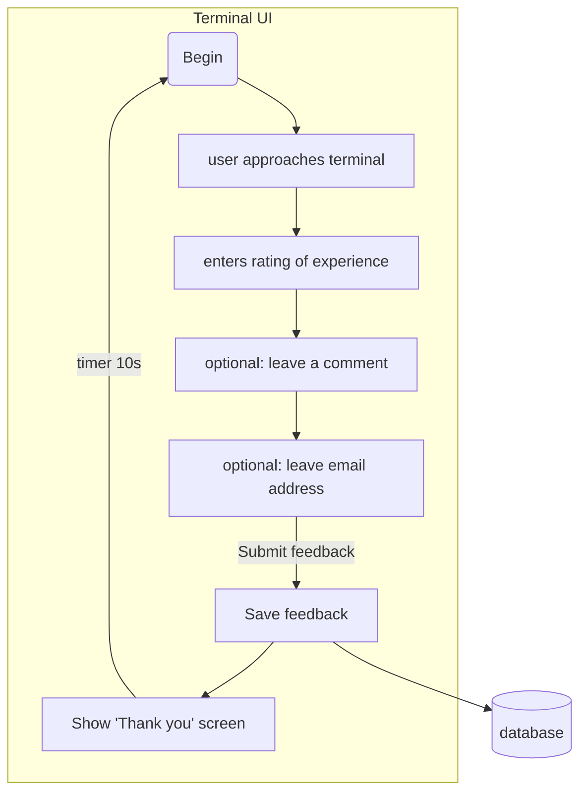
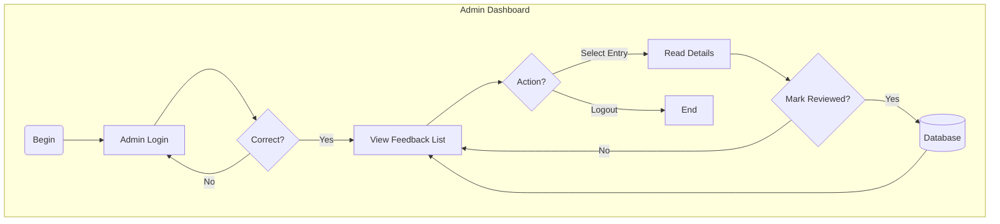
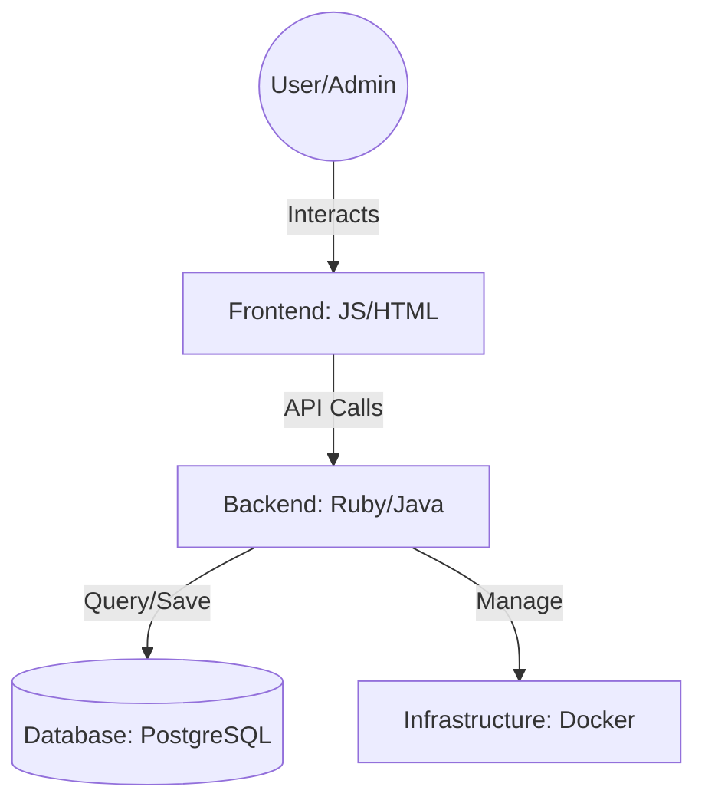
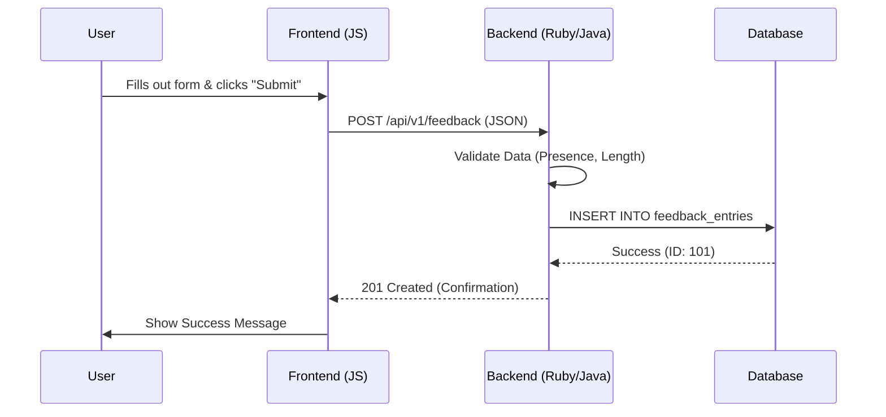
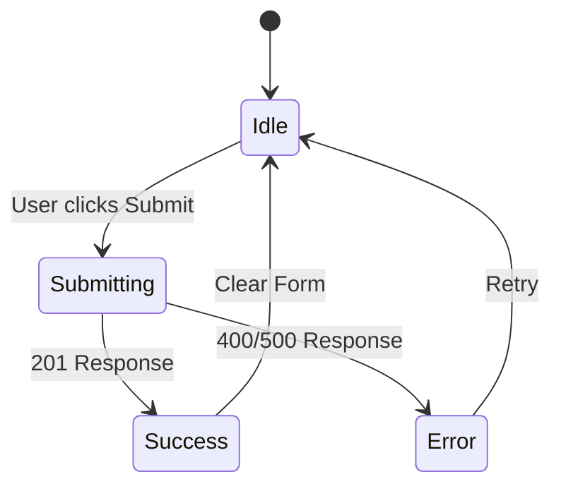

# Feedback system > Specs

**What is the Feedback system's core purpose?**
Collect user's feedback and present them

## System use

### Use case: User wants to leave feedback

### Use case: Admin wants to view user's feedback

## Component map

How the backend interacts with the frontend and database.

## Backend logic

What happens when a feedback is submitted.

## Frontend UI

